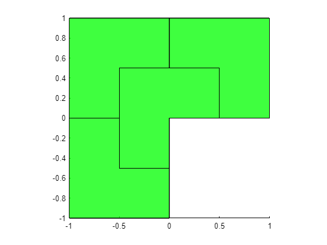
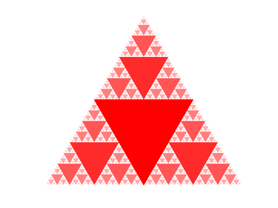
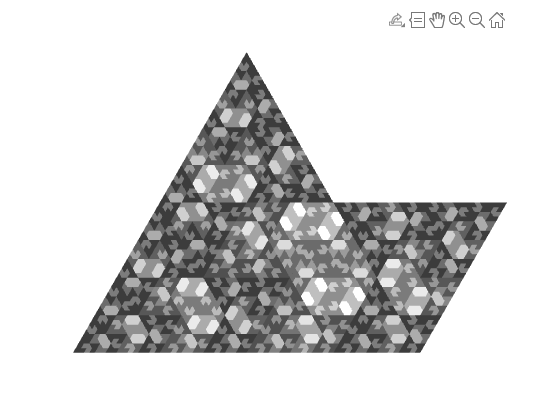
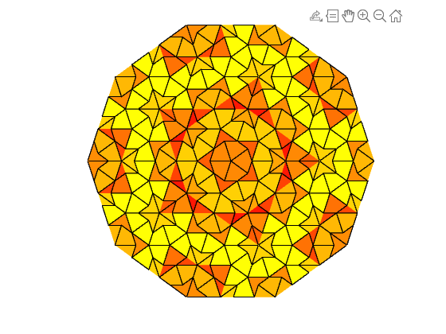
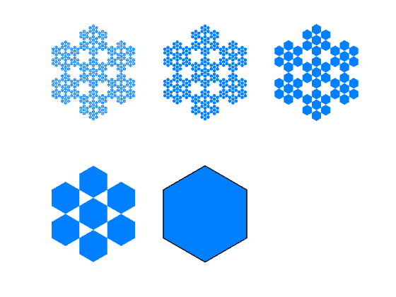

# Substitution Fractals
  
# Manual Example

```matlab:Code
figure;
axis;

X = [-1 1 1 0 0 -1];
Y = [1 1 0 0 -1 -1];
patchOptions = {'g', 'FaceAlpha', 0.5};

p = patch(X, Y, patchOptions{:});

rotatex = @(x,y,t) x*cos(t) - y*sin(t);
rotatey = @(x,y,t) x*sin(t) + y*cos(t);

hold on;

p = patch(X/2-0.5, Y/2+0.5, patchOptions{:});
p = patch(X/2, Y/2, patchOptions{:});
p = patch(rotatex(X/2, Y/2, -pi/2)+0.5, rotatey(X/2, Y/2, -pi/2)+0.5, patchOptions{:});
p = patch(rotatex(X/2, Y/2, pi/2)-0.5, rotatey(X/2, Y/2, pi/2)-0.5, patchOptions{:});

axis equal tight
```





```matlab:Code

```

# Single Example

```matlab:Code
frac = SierpinskiTriangle([0,0], 0, 0, 1, 6);
% frac = PythagoreanTree([0,0], 0, 0, 1, 8, pi/3);
% frac = KochSnowflake([0,0], 0, 0, 1, 8, 3/5);
% frac = DragonCurve([0,0], 0, 0, 1, 11);

tic;
figure;
tl = tiledlayout('flow');
nexttile(frac.d+1);
patch(frac.getX, frac.getY, [1 0 0], 'FaceAlpha', 1, 'EdgeColor', [1 0 0]);

for ii = frac.getAllChildren
    % nexttile(ii.d+1);
    patch(ii.getX, ii.getY, [1 0 0], 'FaceAlpha', ii.d/frac.d, 'EdgeColor', 'none');
end

for ii = tl.Children
    axis(ii, 'equal', 'tight', 'off');
end
```





```matlab:Code
toc;
```


```text:Output
Elapsed time is 1.667931 seconds.
```

# Multiple Example

```matlab:Code
col1 = [1 1 1];
col2 = [0 0 0];

tic;
frac = Sphinx5([0,0], 0, 0, 1, 5);
toc;
```


```text:Output
Elapsed time is 0.280996 seconds.
```


```matlab:Code

figure;
patch(frac.getX, frac.getY, col1, 'FaceAlpha', 0.25, 'EdgeColor', 'none');

for ii = frac.getAllChildren
    patch(ii.getX, ii.getY, ...
        col1*isa(ii, 'U5')+col2*isa(ii, 'Sphinx5'), ...
        'FaceAlpha', 0.25, 'EdgeColor', 'none');
end

axis equal off
```





```matlab:Code

```

# Penrose Example

```matlab:Code
frac = PenroseSun([0 0], 0, 0, 1, 6);
col1 = [1 0 0]; col2 = [1 1 0];

tic;
figure; 
for ii = frac.getAllChildren
    x = ii.getX; y = ii.getY;
    patch(x(1:end-1), y(1:end-1), ...
        col1*isa(ii, 'PenroseHalfdart')+col2*isa(ii, 'PenroseHalfkite'), ...
        'FaceAlpha', ii.d/frac.d, 'EdgeColor', 'none');
    if ii.d == 1
        patch(x, y, [0 0 0], 'EdgeColor', 'k');
    end
end

axis equal off; 
```





```matlab:Code
toc;
```


```text:Output
Elapsed time is 6.648079 seconds.
```


```matlab:Code

```

# Flake (Parametrised) Example

```matlab:Code
frac = FlakePenta([0,0], 0, 0, 1, 4, 6);

tic;
figure;
tl = tiledlayout('flow');
nexttile(frac.d+1);
patch(frac.getX, frac.getY, [0 0.5 1], 'FaceAlpha', 1);

for ii = frac.getAllChildren
    nexttile(ii.d+1);
    patch(ii.getX, ii.getY, [0 0.5 1], 'EdgeColor', 'none');%, 'FaceAlpha', ii.d/frac.d, 'EdgeColor', [0 0 0]);
end

for ii = tl.Children
    axis(ii, 'equal', 'tight', 'off');
end
```





```matlab:Code
toc;
```


```text:Output
Elapsed time is 12.515915 seconds.
```

